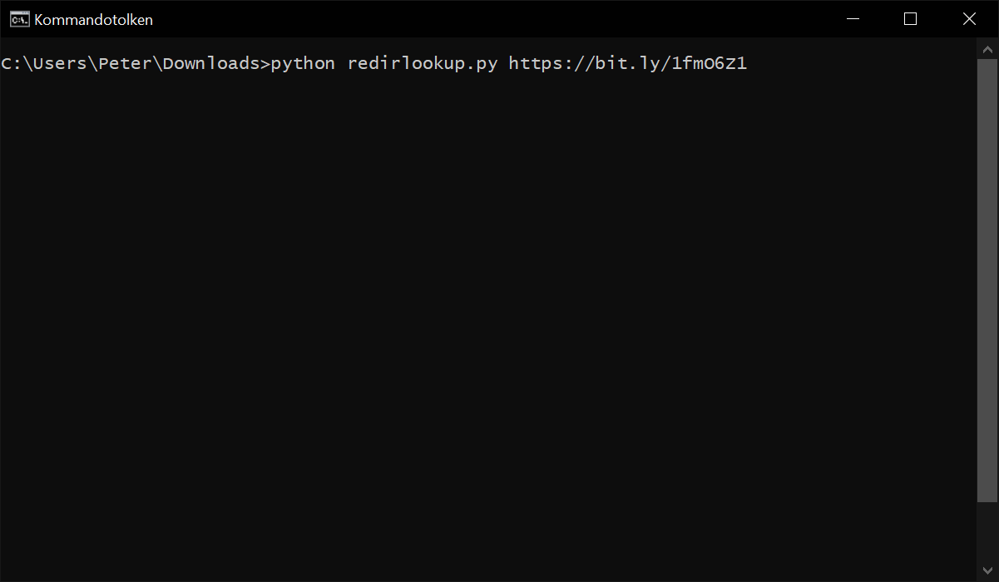

# Redirlookup

Redirlookup will follow and display the redirects from a given list of URLs. The result is shown as JSON.

This tool can help you:

- Follow the destination of link shorteners such as `bit.ly` or `t.co`
- Integrate lookup into your command line workflow using pipes and `jq`
- Automate lookup



## Requirements

- Python 3

## Usage

```
redirlookup.py [urls] [-f urls.txt]
```

Where `urls` is any number of URLs, and `-f urls.txt` is a file with URLs (one per line).

## Examples

### Basic usage

```bash
$ python redirlookup.py http://wikipedia.org/
```

Output:
```
[
  {
    "url": "http://wikipedia.org/",
    "redirects": [
      "http://wikipedia.org/",
      "https://wikipedia.org/",
      "https://www.wikipedia.org/"
    ]
  }
]
```

Note: 

- the original URL is always included as the first URL among the redirects
- you can add as many URLs as you like on the command line

### Save results to file

```bash
$ python redirlookup.py http://wikipedia.org/ http://amazon.com http://google.cm > output.json
```

### Input file

Use input file (with one URL per line), and save results to file.

```bash
$ python redirlookup.py -f urls.txt > output.json
```